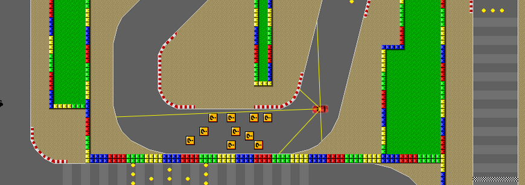
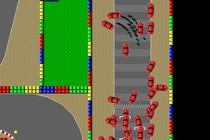
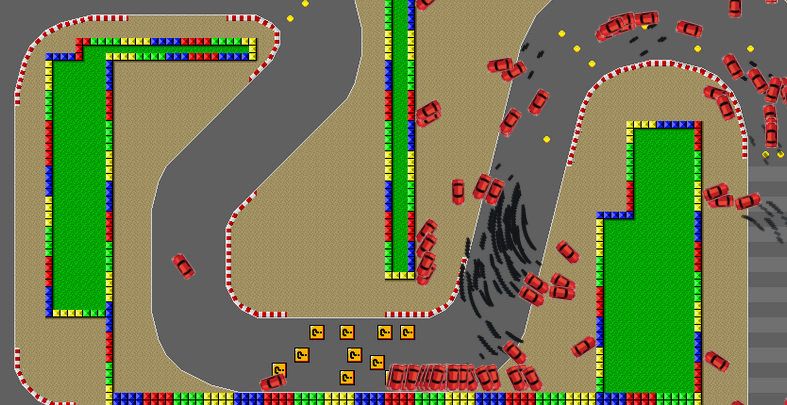
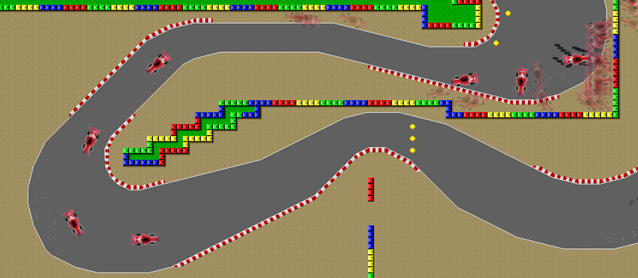

# neural-network-race

https://fpirsch.github.io/neural-network-race/

Inspired by this video https://www.youtube.com/watch?v=wL7tSgUpy8w

A little car racing game in which an AI learns to drive, and you can play against it.

## How it works

The AI needs very few information, just 6 numbers : its speed, and distances to the edge of the track in 5 directions. A neural network transforms them into 4 numbers corresponding to the 4 keyboard arrows. Positive means press the button, negative is don't press.

*Yellow lines are anti-collision radars. Hit **R** to display.*

In the 1st generation, 256 neural networks are completeley random-generated, each assigned to a car. Those 256 cars driving simultaneously usually don't go very far.

*Typical first generation*

The 10 best among them are chosen to be the parents of the next generation. The 256 children have only a few weights randomly mutated.

Generation after generation, the AIs drive the cars further and further, figure out how to turn left and right and to negociate tight turns.

*Here it took 6 generations to get 1 AI to figure out how to turn left-right-right*

Everything is random, but usually after 5 - 10 generations at least one AI manages to finish one turn, then 2 turns.

It takes a few more generations to master a much faster car.

*Here after 17 generations, a few AIs could finish a turn with the F1.*

## Getting technical

## Physics engine

Basic 2D integrating position from acceleration and drag force. Collision detection only with walls and lawn.

Inspired by [this article from Livio De La Cruz](https://superheroesinracecars.com/2016/08/11/implementing-racing-games-an-intro-to-different-approaches-and-their-game-design-trade-offs/).

### Neural network

[Multi-layer perceptron](https://en.wikipedia.org/wiki/Multilayer_perceptron) with 2 hidden layers. The activation function is a [leaky ReLU](https://en.wikipedia.org/wiki/Rectifier_(neural_networks)#Leaky_ReLU).
All weights are kept between -1 and 1.

### Genetic algorithm

Population: 256 individuals. For the 1st generation, all weights are chosen randomly between -1 and 1, except the biases which are all 0. 
The 10 best of each generation are selected. They are kept in the next generation, and 246 children are generated by mutating randomly 15% of the parent weights.
The fitness function is the travelled distance (the remaining distance would be better, saving this thought for some day maybe).
